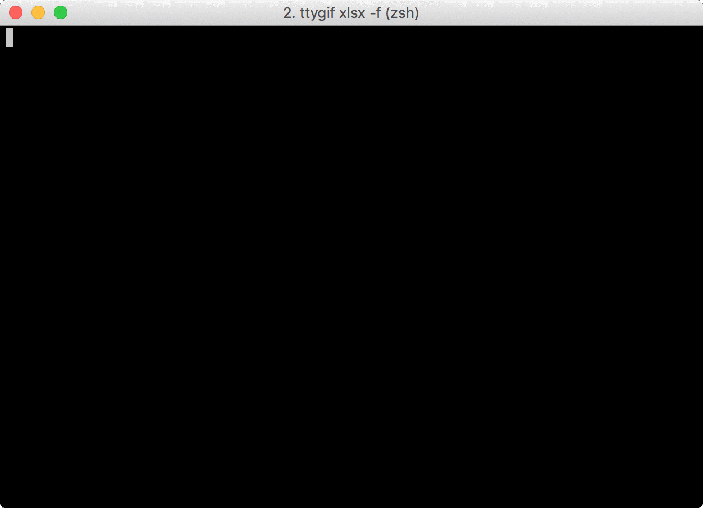

=============
GuiaBolso2csv
=============

GuiaBolso2csv é um simples programa em Python cuja finalidade é baixar os dados de transação do GuiaBolso em formato csv.

O GuiaBolso_ é um app criado para agregar transações de diversas contas e classificá-las de forma *quase* automática. A agregação e a classificação são bastante úteis no auxílio do controle dos gastos. O problema é que a análise dos dados é limitada ao que é oferecido pela plataforma. Além disso, os clientes não têm posse de seus dados, caso a empresa deixe de existir ou ocorra alguma mudança na política, os dados podem ser perdidos para sempre. O GuiaBolso2csv permite que os dados sejam baixados e então usados (e guardados) da forma que for mais conveniente. Além do formato csv há a opção de gerar um arquivo xlsx (formato do Excel).

.. _GuiaBolso: https://www.guiabolso.com.br/

Funcionalidades
---------------

* Baixe suas transações categorizadas do GuiaBolso.

* Exporte facilmente para uma planilha do Excel.

Obtendo
-------

O jeito mais fácil de instalar é usando o ``pip`` (pode ser necessário usar sudo). Basta fazer ::

    pip install guiabolso2csv

Uso Básico
----------
O guiabolso2csv pode ser usado com opções de linha de comando ou de forma interativa. Assim, se você rodar o programa sem opções, vai funcionar como a seguir::

    guiabolso2csv

.. image:: docs/simple.gif

Observe como foi perguntado os dados de login além do ano e mês das transações de interesse. Finalmente um arquivo csv é baixado para o diretório atual.

Alternativamente, o mesmo poderia ser feito usando opções por linha de comando::

    guiabolso2csv --email example@example.com --year 2016 --month 12

.. image:: docs/options.gif

O único dado não especificado foi a senha, que é requisitada pelo programa.

Qualquer dúvida no uso das opções basta fazer::

    guiabolso2csv --help

.. image:: docs/help.png

Outras Opções
-------------
Algumas funcionalidades não são disponíveis de forma interativa. A seguir será mostrado como obter um intervalo com vários meses e como obter os arquivos de saída direto no formato do Excel (xlsx).

Intervalo de Meses
..................
Para obter um intervalo de meses basta usar as opções ``--last-year`` e ``--last-month``. O programa baixa automaticamente arquivos para todos os meses desde ``MONTH/YEAR`` até ``LAST_MONTH/LAST_YEAR``, por exemplo::

    guiabolso2csv --email example@example.com --year 2016 --month 12 --last-year 2017 --last-month 6

Baixando em Formato do Excel
............................

Além de ``csv``, você pode baixar os dados de transação diretamente no formato ``xlsx``. Para isso basta usar a flag ``--excel``, por exemplo::

    guiabolso2csv --email example@example.com --year 2016 --month 12 --excel

Baixando o repositório
----------------------

Caso deseje contribuir para este reprositório ou simplesmente prefere baixar diretamente (sem usar o PyPI). Siga as instruções a seguir.

Você deve ter ``git`` e ``pip`` instalados para, respectivamente, baixar o repositório e instalar as dependências.

Clone o repositório::

    git clone git@github.com:hugombarreto/guiabolso2csv.git

Vá para o repositório que você acabou de clonar e instale as dependências com ``pip``::

    cd guiabolso2csv
    pip install -r requirements.txt

Pronto, você já pode usar o GuiaBolso2csv a partir do código baixado fazendo::

    python guiabolso2csv

