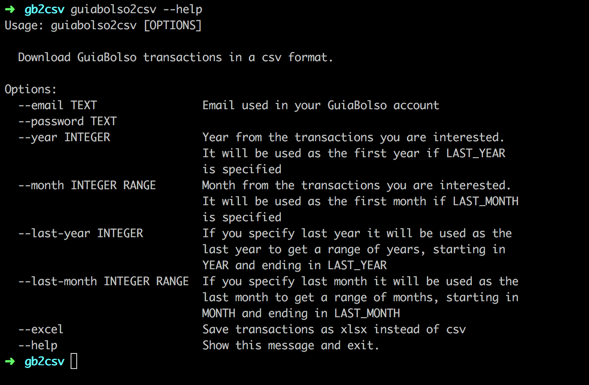

=============
GuiaBolso2csv
=============

GuiaBolso2csv é um simples programa em Python cuja finalidade é baixar os dados de transação do GuiaBolso em formato csv.

O GuiaBolso_ é um app criado para agregar transações de diversas contas e classificá-las de forma *quase* automática. A agregação e a classificação são bastante úteis no auxílio do controle dos gastos. O problema é que a análise dos dados é limitada ao que é oferecido pela plataforma. Além disso, os clientes não têm posse de seus dados, caso a empresa deixe de existir ou ocorra alguma mudança na política, os dados podem ser perdidos para sempre. O GuiaBolso2csv permite que os dados sejam baixados e então usados (e guardados) da forma que for mais conveniente. Ainda, o fato de ser gerado um arquivo csv facilita a exportação para o Excel.

.. _GuiaBolso: https://www.guiabolso.com.br/

Funcionalidades
---------------

* Baixe suas transações categorizadas do GuiaBolso.

* Exporte facilmente para uma planilha do Excel.

Obtendo
-------

Você deve ter `git` e `pip` instalados para, respectivamente, baixar o repositório e instalar as dependências.

Clone o repositório::

    git clone git@github.com:hugombarreto/guiabolso2csv.git

Vá para o repositório que você acabou de clonar e instale as dependências com `pip`::

    cd guiabolso2csv
    pip install -r requirements.txt

Pronto, você já pode usar o GuiaBolso2csv executando o `main.py` como exemplificado a seguir.

Exemplos de Uso
---------------
Você pode usar o programa passando opções por linha de comando ou, se preferir, esperando que o programa pergunte. Assim, se você rodar o programa sem opções, vai funcionar como a seguir::

    python main.py

Observe como foi perguntado os dados de login além do ano e mês das transações de interesse. Finalmente um arquivo csv é baixado para o diretório atual.

Alternativamente, o mesmo poderia ser feito usando opções por linha de comando::

    python main.py --email example@example.com --cpf 1234567890 --year 2016 --month 12

O único dado não especificado foi a senha, que foi perguntada pelo programa.

Qualquer dúvida no uso das opções basta fazer::

    python main.py --help

